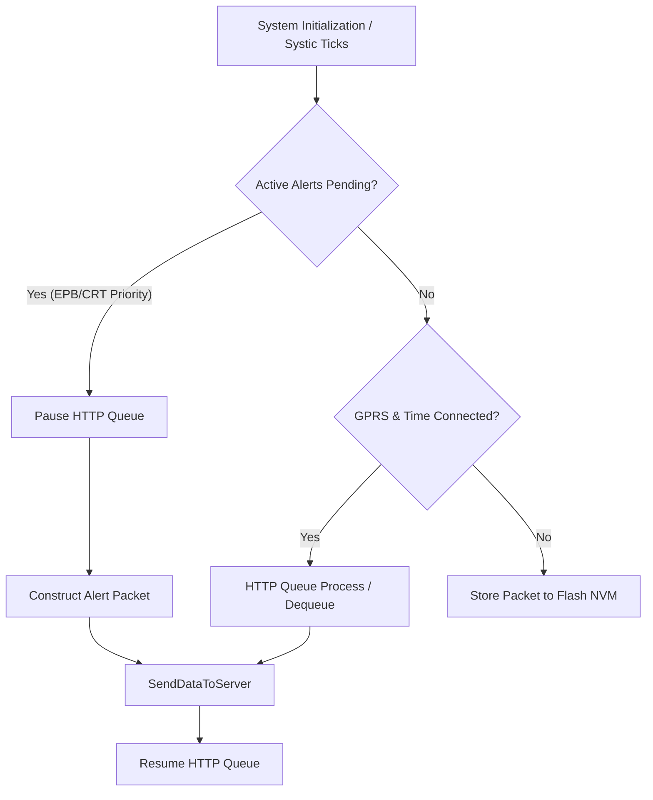

# CDAC (CD1) AIS-140 Protocol & Firmware Architecture Manual

---

## 1. Executive Summary & System Overview

This document provides a production-grade, exhaustive technical specification of the **CDAC (CD1) AIS-140 Vehicle Tracking & Monitoring Protocol** as implemented in the InnoVTS M66 OpenCPU firmware.

### 1.1 Hardware and OS Platform Context
- **Microcontroller / System-on-Chip**: MediaTek MT6261 based Quectel M66 OpenCPU GSM/GNSS module.
- **Operating System**: RTOS based on ThreadX, providing a multi-tasking OpenCPU execution environment.
- **SDK Version**: QuecOpen GS3 SDK V2.6.
- **Target Application**: AIS-140 compliant Intelligent Transportation System (ITS) firmware.

### 1.2 Core Architectural Pattern
The CDAC implementation operates under a **state-driven, dual-transmission architecture** designed for high reliability in remote, low-signal telemetry environments. Key highlights include:
1. **Dual-Server Reporting**: Automatic simultaneous delivery of all packets to primary and secondary servers.
2. **Circuit Breaker Mechanism**: Dynamic isolation of failing primary servers to prevent blocking critical alerts.
3. **Emergency Bypass Pipeline**: Immediate bypass of normal HTTP queues during emergency events (SOS / wire-cut).
4. **Offline Buffer Store-and-Forward**: Automatic priority-based batching and evacuation of stored telemetry.



---

## 2. Compile-Time Configurations & Module Dependencies

The CDAC feature set is activated using compile-time preprocessor flags that control conditional code compilation.

### 2.1 Core Feature Toggle
The primary switch is declared in [custom/config/custom_proto_cfg.h](file:///d:/QUICKTEL/InnoVTSM66_VY/InnoVTSM66/custom/config/custom_proto_cfg.h):

```c
#ifndef PROTO_CDAC
#define PROTO_CDAC        // Active build variant for CDAC (CD1)
#endif
```

This flag is wrapped into a compile-time truth macro in [custom/inc/VTS.h](file:///d:/QUICKTEL/InnoVTSM66_VY/InnoVTSM66/custom/inc/VTS.h):

```c
#ifdef PROTO_CDAC
#define IS_PROTO_CDAC()   (1)
#else
#define IS_PROTO_CDAC()   (0)
#endif
```

### 2.2 Compilation and Dependency Constraints

| Macro Flag | Location | CDAC Required Setting | Functional Impact / Dependencies |
| :--- | :--- | :--- | :--- |
| `HTTP_QUEUE` | `custom_feature_def.h` | **ENABLED (defined)** | Compiles RAM/Flash HTTP packet store-and-forward queueing. |
| `ENABLE_UNIFIED_FIRMWARE` | `custom_feature_def.h` | **DISABLED (undefined)** | Must be undefined. If enabled, forces `IS_PROTO_CDAC()` to return 0. |
| `ENABLE_BATTERY_MONITOR` | `custom_feature_def.h` | **DISABLED (undefined)** | Must be undefined to prevent float trace crashes during battery polling. |
| `KEEP_ALIVE` | `VTS.h` | **ENABLED** | Enables GPRS TCP/HTTP connection keep-alive mode. |
| `PROTO_TAG` | `VTS.h` | `"CD1"` | Sets regional standard tag for version queries. |
| `ALERT_COUNT` | `Alert.h` | `19` | Limits the alert slots to 19 (instead of 21 in standard protocol). |

---

## 3. Server Architecture & Send Orchestration (Server 1 vs Server 3)

The CDAC transmission engine enforces dual-transmission of telemetry packets to a primary Regional Server and a secondary Third Server.

```
                           ┌───────────────────────────┐
                           │   Server / HTTP Thread    │
                           └─────────────┬─────────────┘
                                         │
                                SendDataToServer()
                                         │
                   ┌─────────────────────┴─────────────────────┐
                   ▼                                           ▼
         Server 1 (Primary CDAC)                     Server 3 (3rd Server / VLT)
     surakshamitr.org/CDC:443 (HTTP)               Configured via 'SET SU:<URL>'
                                                     (HTTP POST or Raw TCP Socket)
```

### 3.1 Server Connections & Configuration Storage
Server parameters are defined at compilation and stored persistently in Flash NVM inside `VTSData.ServerData`.

In [custom/inc/VTS.h](file:///d:/QUICKTEL/InnoVTSM66_VY/InnoVTSM66/custom/inc/VTS.h):
```c
#ifdef PROTO_CDAC
  #define DEFAULT_IP1   "http://surakshamitr.org/CDC"   // Primary CDAC Endpoint (Server 1)
  #define DEFAULT_PORT1 "443"

  #define DEFAULT_IP2   "NA"                            // Unused in CDAC

  #define DEFAULT_IP3   "http://78.46.190.117/vlt"      // Secondary 3rd Server Endpoint (Server 3)
  #define DEFAULT_PORT3 "50024"
#endif
```

Configuration Struct definition in `VTS.h`:
```c
typedef struct {
    char IP1[128];    // Primary URL (Server 1)
    char Port1[6];
    char IP2[50];     // Unused in CDAC
    char Port2[6];
    char IP3[128];    // Secondary VLT URL or Raw IP (Server 3)
    char Port3[6];
    char IP4[50];
    char Port4[6];
    uint8_t IPConfig[4];
} ServerConfigTypedef;
```

---

### 3.2 3rd Server (`SU`) Endpoint Normalization & Transport Selection

The 3rd Server (`SU`) supports dual transport modes based on the scheme of the configured URL string:
1. **HTTP Mode**: If the endpoint URL contains `http://` or `https://`, the socket is initialized as HTTP. Packets are encapsulated in HTTP POST requests under parameter name `vltdata=`.
2. **Raw TCP Socket Mode**: If the endpoint lacks a scheme prefix (e.g. bare domain or IP like `78.46.190.117`), the firmware opens a direct, raw TCP socket and sends raw ASCII telemetry.

This is managed by `UpdateSecondaryURL()` and the helper `ServerNormalizeEndpoint()` in [custom/Server.c](file:///d:/QUICKTEL/InnoVTSM66_VY/InnoVTSM66/custom/Server.c):

```c
void UpdateSecondaryURL(char* value) {
    char url[128];
    char port[sizeof(VTSData.ServerData.Port3)];

    if (!value) return;

    // Save current port as fallback
    ServerCopyText(port, sizeof(port), VTSData.ServerData.Port3);
    
    // Normalize URL and extract port details
    ServerNormalizeEndpoint(value, url, sizeof(url), port, sizeof(port));

    Ql_strncpy(VTSData.ServerData.Port3, port, sizeof(VTSData.ServerData.Port3) - 1);
    VTSData.ServerData.Port3[sizeof(VTSData.ServerData.Port3) - 1] = '\0';
    
    Ql_strncpy(VTSData.ServerData.IP3, url, sizeof(VTSData.ServerData.IP3) - 1);
    VTSData.ServerData.IP3[sizeof(VTSData.ServerData.IP3) - 1] = '\0';

    // Auto-detect transport: 0 = HTTP POST Mode, 1 = Raw TCP Mode
    ServerSocket[2].isEnabled = IsHttpUrl(VTSData.ServerData.IP3) ? 0 : 1;
    ServerSocket[2].SocketState = SOCKET_CLOSED;
    
    Ql_strncpy(ServerSocket[2].DNSorIP, VTSData.ServerData.IP3, sizeof(ServerSocket[2].DNSorIP) - 1);
    ServerSocket[2].DNSorIP[sizeof(ServerSocket[2].DNSorIP) - 1] = '\0';
    ServerSocket[2].Port = Ql_atoi(VTSData.ServerData.Port3);
}
```

---

### 3.3 Dynamic Outage Circuit Breaker for Server 1

To prevent connection timeouts to a failing Server 1 from blocking the transmission thread and locking up the device, a circuit breaker pattern is implemented:

- **Circuit Breaker Parameters**:
  - `SERVER1_MAX_FAILURES = 2`: Consecutive failed HTTP POST attempts before triggering.
  - `SERVER1_COOLDOWN_MS = 300000` (5 minutes): Time window during which Server 1 is skipped entirely.
- **Failover Behavior**:
  - When the circuit breaker is active (`server1_offline = 1`), `SendDataToServer()` skips Server 1 and proceeds immediately to transmit to Server 3.
  - After 5 minutes, a probe attempt is made. If successful, the circuit breaker resets (`server1_offline = 0`).

---

### 3.4 Shared QHTTP Session Reentrancy & Concurrency Guards

The Quectel M66 OpenCPU HTTP client operates using a single, shared GPRS HTTP session stack. Under concurrent access, this session can become corrupted. The CDAC implementation introduces three key safeguards:

#### 1. Removal of Reentrant Callbacks
The connection callback was stripped from `HTTP_SetReadyState()` in [custom/HTTP.c](file:///d:/QUICKTEL/InnoVTSM66_VY/InnoVTSM66/custom/HTTP.c):
```c
// Reference State Control - sets state variables only
void HTTP_SetReadyState(uint8_t state) {
    HTTPState = state;
    // OnConnect callback trigger was removed to prevent injecting a secondary
    // send process into the shared QHTTP session while a POST is mid-flight.
}
```

#### 2. Concurrency-Safe State Registers
State variable definitions are marked as `volatile` to prevent compilers from optimization caching and ensure consistency across ThreadX execution threads:
```c
volatile uint8_t HTTPState = 0;
volatile uint8_t IsHTTPRes = 0;
volatile uint8_t HTTPConnectFlag = 0;
```

#### 3. Connect Cleanups & Socket State Resets
Whenever switching endpoints from Server 1 to Server 3 inside `SendDataToServer()`, the session is explicitly terminated to prevent host header mismatch rejections (`AT+QHTTPPOST ret=-1`):
```c
HTTP_Close(0); // Tear down active session
ServerSocket[0].SocketState = SOCKET_IDLE; // Reset socket state
ThreadSleep(500); // Allow modem settle window
```

---

## 4. CD1 Wire Protocol & Packet Layouts

Every CDAC packet sent via HTTP POST is an ASCII-formatted string prefixed with `vltdata=` (8 bytes, `dLen = 8`).

### 4.1 Shared Telemetry Base Builder: `DataPacket()`
The core telemetry data block is built by `DataPacket()` in [custom/Server.c](file:///d:/QUICKTEL/InnoVTSM66_VY/InnoVTSM66/custom/Server.c). All offsets listed are relative to the start of the payload string (excluding `vltdata=`).

| Offset | Length | Field | Sample | Description |
| :---: | :---: | :--- | :--- | :--- |
| **0** | 3 | Packet Header | `NRM`, `ALT`, `CRT`, `EPB` | ASCII Header Type |
| **3** | 15 | IMEI | `864201040123456` | 15-digit Device IMEI |
| **18** | 2 | Packet Index | `01` | Incremental Packet Index |
| **20** | 1 | Packet Source | `L` / `H` | `L` = Live telemetry, `H` = Stored History |
| **21** | 1 | GPS Fix Status | `1` / `0` | `1` = Valid 3D Fix, `0` = Invalid |
| **22** | 12 | RTC Date & Time | `080826135000` | Indian Standard Time `DDMMYYHHMMSS` |
| **34** | 10 | Latitude | `1258.123456` | `%010.6f` DDMM.MMMMMM |
| **44** | 1 | Latitude Direction | `N` / `S` | `N` = North, `S` = South |
| **45** | 10 | Longitude | `07734.123456` | `%010.6f` DDDMM.MMMMMM |
| **55** | 1 | Longitude Direction| `E` / `W` | `E` = East, `W` = West |
| **56** | 3 | MCC | `404` | Mobile Country Code |
| **59** | 3 | MNC | `x45` | Mobile Network Code (left-padded with `x`) |
| **62** | 4 | LAC | `1A2F` | 4-hex-digit Location Area Code |
| **66** | 9 | Cell ID | `00001234A` | 9-hex-digit Cell Identification |
| **75** | 6 | Vehicle Speed | `045.20` | `%06.2f` Speed in km/h |
| **81** | 6 | Heading Angle | `180.50` | `%06.2f` Heading in Degrees |
| **87** | 2 | Satellites Count | `12` | Tracked GPS Satellites |
| **89** | 2 | HDOP | `01` | Horizontal Dilution of Precision |
| **91** | 2 | CSQ Signal Level | `24` | GSM Signal Level (0–31) |
| **93** | 1 | Ignition State | `1` / `0` | `1` = Ignition ON, `0` = Ignition OFF |
| **94** | 1 | Main Power State | `1` / `0` | `1` = External Input Present, `0` = Removed |
| **95** | 1 | Vehicle Moving Mode| `M` / `H` / `S` | `M` = Motion, `H` = Halt, `S` = Sleep |
| **96** | 7 | Altitude | `00540.2` | Meters Above Sea Level |
| **103** | 6 | Operator Code | `AIRTEL` | Network Operator (Right-padded with `X`) |

---

### 4.2 Packet Variants

#### 1. Login Packet (`LGN`)
Sent to verify device credentials upon connection.
- **Syntax**: `vltdata=LGN` + IMEI(15) + ActivationKey(16) + Lat(10)+Dir + Lon(10)+Dir + DateTime(12) + Speed(6)
- **Format**: Fixed-length ASCII.

#### 2. Normal Position Packet (`NRM`)
Standard periodic position tracking message.
- **Syntax**: `vltdata=NRM01L` + `DataPacket()` payload.

#### 3. Health Keep-Alive Packet (`HLM`)
Dispatched during vehicle halt or sleep conditions.
- **Syntax**: `vltdata=HLM` + VendorID(6) + FirmVer(6) + IMEI(15) + MotionInterval(3) + HaltInterval(3) + Batt%(3) + LowBattThr(2) + `060` + Digital I/O States(4) + `01` + IST DateTime(12)

#### 4. Full Status Packet with CRC16 (`FUL`)
Diagnostic packet containing extensive cellular neighbor information and analog readings.
- **Structure**: `vltdata=FUL01L` + `DataPacket()` + VendorID(6) + FirmVer(6) + RegNo(16) + Altitude(7) + PDOP(2) + NetworkName(6) + NeighborCells(60 bytes, 4 cells x 15 bytes) + MainsVolt(5) + BattVolt(5) + CoverOpen(1) + I/O states(4) + FrameNumber(6) + **CRC16 (8-digit hex)**
- **CRC Calculation**: Computed over 220 bytes starting at index `dLen` (offset 8) using `CRC16(&SendString[dLen], 220)`. The hex string is appended to the packet using:
  ```c
  crc = CRC16(&SendString[dLen], 220);
  Ql_sprintf(tempData, "%08X", crc);
  InsertStringValue(tempData, dLen + 220, 8, 1);
  ```

#### 5. Batch Offline Packet (`BTH`)
Encloses historical telemetry records retrieved from flash memory.
- **Structure**: `vltdata=BTH` + IMEI(15) + PacketCount(3) + Concatenated history payload strings.
- **IMEI Extraction & Source Conversions**: During concatenation, `MakeBatchPacket()` strips the redundant prefix/IMEI from history records and replaces the index/source fields:
  ```c
  pt += 15; // Bypass IMEI
  if (pt[0] == '0' && pt[1] == '1') {
      pt[1] = '2'; // Convert index 01 to 02
  }
  pt[2] = 'H'; // Force packet source type from 'L' (Live) to 'H' (History)
  ```

- **Priority Sorting**: Stored packets are sorted using `GetBatchPacketPriority()` to transmit alert records before normal position logs:
  - Priority: `EPB` (0) > `CRT` (1) > `ALT` (2) > `ACK` (3) > `NRM` (4).

---

## 5. CDAC Alert Engine & Priority System

CDAC defines a 19-alert matrix managed via three parallel lookup arrays.

### 5.1 Parallel Lookup Arrays
In [custom/inc/Alert.h](file:///d:/QUICKTEL/InnoVTSM66_VY/InnoVTSM66/custom/inc/Alert.h):
```c
#define ALERT_COUNT 19

// Maps Alert Index to Header Type: 0 = EPB, 1 = CRT, 2 = ALT, 3 = ACK
static const uint8_t VTAlertHeaderType[ALERT_COUNT] = {0,0,1,1,1,2,1,2,2,2,1,1,1,2,2,3,2,2,2};

// Maps Alert Index to Packet ID Code
static const char    VTAlertPKT[ALERT_COUNT][3]     = {"10","11","16","03","22","09","17","13","14","15","23","20","21","18","19","12","06","04","05"};

// Maps Alert Index to Repeat/Continuous Mode: 0 = None, 1 = URE, 2 = Normal
static const uint8_t VTContType[ALERT_COUNT]        = {1,0,2,0,2,0,2,0,0,0,0,0,0,0,0,0,0,0,0};
```

---

### 5.2 Master Alert Matrix Reference

| Index | Constant Name | Packet ID | Header | Repeat Mode | Description |
| :---: | :--- | :---: | :---: | :---: | :--- |
| **0** | `SOS_ON_ALERT` | `10` | `EPB` | `1` (URE) | SOS Button Pressed (Active Emergency) |
| **1** | `SOS_OFF_ALERT` | `11` | `EPB` | `0` (None) | SOS Button Released / Deactivated |
| **2** | `SOS_TMP_ALERT` | `16` | `CRT` | `2` (Normal) | SOS Wire Tamper / Wire Cut |
| **3** | `MAINS_FAIL_ALERT` | `03` | `CRT` | `0` (None) | Main Battery Power Input Removed |
| **4** | `TILT_ALERT` | `22` | `CRT` | `2` (Normal) | Vehicle Tilt Threshold Exceeded |
| **5** | `TAMPER_ALERT` | `09` | `ALT` | `0` (None) | Device Casing Opened (Cover Tamper) |
| **6** | `OVER_SPEED_ALERT` | `17` | `CRT` | `2` (Normal) | Speed Threshold Exceeded |
| **7** | `HARSH_BRK_ALERT` | `13` | `ALT` | `0` (None) | Harsh Braking Event Detected |
| **8** | `HARSH_ACC_ALERT` | `14` | `ALT` | `0` (None) | Harsh Acceleration Event Detected |
| **9** | `RASH_TURN_ALERT` | `15` | `ALT` | `0` (None) | Rash Turning Event Detected |
| **10** | `IMPACT_ALERT` | `23` | `CRT` | `0` (None) | Vehicle Impact / Crash Event |
| **11** | `GFIN_OS_ALERT` | `20` | `CRT` | `0` (None) | Overspeed inside Geofence Zone |
| **12** | `GFOUT_OS_ALERT` | `21` | `CRT` | `0` (None) | Overspeed outside Geofence Zone |
| **13** | `GFIN_ALERT` | `18` | `ALT` | `0` (None) | Geofence Boundary Entry |
| **14** | `GFOUT_ALERT` | `19` | `ALT` | `0` (None) | Geofence Boundary Exit |
| **15** | `CONF_CHANGE_ALERT`| `12` | `ACK` | `0` (None) | Parameter Configuration Change ACK |
| **16** | `MAINS_RES_ALERT` | `06` | `ALT` | `0` (None) | Main External Power Input Restored |
| **17** | `BATT_LOW_ALERT` | `04` | `ALT` | `0` (None) | Internal Lithium Battery Voltage Low |
| **18** | `BATT_LOW_RES_ALERT`| `05` | `ALT` | `0` (None) | Internal Lithium Battery Restored |

---

### 5.3 Emergency Queue Bypassing

Critical alerts (`HeaderType <= 1`, i.e., `EPB` and `CRT` packets) require immediate server reporting. If GPRS is connected, they bypass the HTTP Store-and-Forward Queue entirely:

```c
// Force pause the normal HTTP queue thread to secure the shared session
HttpQueue_Pause();

// Wait for any active telemetry POST to finish (up to 3 seconds)
uint8_t w = 0;
while((IsSendProcess || HttpQueue_IsSending()) && w < 30) {
    ThreadSleep(100);
    w++;
}

// If normal sending is hung, abort the active socket process immediately
if(IsSendProcess || HttpQueue_IsSending()) {
    HttpQueue_AbortSend();
    ThreadSleep(200);
}

// Transmit the EPB / CRT alert packet directly to Server 1 & Server 3
resp = SendDataToServer(CriticalString[i], ..., criticalTimeout);

// Resume normal queue operation
HttpQueue_Resume();
```

---

### 5.4 SMS Alert Engine
In addition to GPRS, CDAC routes critical notifications via SMS. The SMS formatter aggregates the current status in a machine-readable format and sends it to all administrative mobile numbers (`Mob0` to `Mob3`).

Format inside `SMSAlert()` in [custom/Server.c](file:///d:/QUICKTEL/InnoVTSM66_VY/InnoVTSM66/custom/Server.c):
- **SMS Body**: `<AlertCode>,<IMEI>,<VehReg>,<DDMMYY>,<HHMMSS>,<Lat>,<LatDir>,<Lon>,<LonDir> <EventText>`
- **Example**: `10,864201040123456,KL01CA1234,080826,135000,1258.123456,N,07734.123456,E Emergency ON`

---

### 5.5 SOS Emergency State & Wire-Cut Tamper Logic

The CDAC protocol enforces a strict Emergency State machine with priority handling for wire cut (tamper) detection and wire reconnection:

1. **SOS ON Priority Preservation**:
   * When a panic button wire cut (`SOS_TMP_ALERT` Code 16) is detected, the Emergency State (`SOS.IsSOS`) remains active, and `SOS_ON_ALERT` (Code 10) is **not** cleared from memory.
   * Both `SOS_ON_ALERT` (Priority 1) and `SOS_TMP_ALERT` (Priority 2) are transmitted in correct priority order over GPRS.

2. **Wire Reconnection State Preservation**:
   * Reconnecting the cut panic button wire clears the tamper flag (`SOS.IsSOSTamper = 0`) and removes `SOS_TMP_ALERT` (Code 16).
   * It **does not** trigger an immediate `SOS_OFF_ALERT` (Code 11) or abort the emergency state. The Emergency State (`SOS.IsSOS`) continues running its mandatory 30-minute timer.
   * `SOS_OFF_ALERT` is only sent when the full 30-minute timer expires or when the control room sends the `SET EO` OTA command.

---

## 6. OTA Command Parser & Configuration Dictionary

The firmware decodes OTA (Over-the-Air) parameters from 6 input sources:
- **`0`**: SMS (cellular text message)
- **`1`**: Server 1 (Primary CDAC HTTP response)
- **`2`**: Server 2 (Secondary TCP socket response)
- **`3`**: Server 3 (3rd Server HTTP response)
- **`4`**: RS232 Serial Port (local debug terminal)
- **`5`**: RS485 Serial Port (local peripheral bus)

```
       ┌──────────────────────┐
       │   SMS / RS232 / GPRS │
       └──────────┬───────────┘
                  │
                  ▼
         DecodeOTAData(buff)
                  │
           UpdateOTA(keys)
                  │
         ┌────────┴────────┐
         ▼                 ▼
    Update Flash      Generate ACK
```

### 6.1 Command Types
- **SET**: Write parameters. Format: `SET <KEY>:<VALUE>,<KEY2>:<VALUE2>`
- **GET**: Read parameters. Format: `GET <KEY>,<KEY2>`
- **CLR**: Reset parameters. Format: `CLR <KEY>,<KEY2>`

---

### 6.2 Key-Value Dictionary

| Key | Description | Unit / Range | GET Output Sample | CLR Default Value |
| :---: | :--- | :--- | :--- | :--- |
| **`PU`** | Primary Server URL | Scheme, host, port | `http://surakshamitr.org/CDC:443` | `http://surakshamitr.org/CDC:443` |
| **`SU`** | Secondary 3rd Server URL | Scheme, host, port | `http://78.46.190.117/vlt:50024`| `http://78.46.190.117/vlt:50024` |
| **`VN`** | Vehicle Registration Number | ASCII (max 16 chars) | `KL01CA1234` | `KL01CA1234` |
| **`M0`** | Primary Administrator Mobile | 10-digit phone | `+919876543210` (auto +91) | Stored `DEFAULT_MOB0` |
| **`M1`** | Secondary Admin Mobile | 10-digit phone | `+919876543211` | Stored `DEFAULT_MOB1` |
| **`M2`** | Tertiary Admin Mobile | 10-digit phone | `+919876543212` | `+910000000000` |
| **`M3`** | Quaternary Admin Mobile | 10-digit phone | `+919876543213` | `+910000000000` |
| **`OM`** | Operator / Carrier Mobile | 10-digit phone | `+919876543214` | `+910000000000` |
| **`ED`** | Emergency Duration | Seconds | `300` | `180` |
| **`ST`** | Sleep Interval | Minutes | `5` | `5` |
| **`HT`** | Halt Interval | Minutes | `1` | `1` |
| **`UR`** | Normal Motion Interval | Seconds | `10` | `10` |
| **`SL`** | Overspeed Threshold | km/h | `80` | `80` |
| **`TA`** | Tilt Detection Angle | Degrees (0–90) | `45` | `45` |
| **`HBT`** | Harsh Braking Threshold | G-force index | `12` | `12` |
| **`HAT`** | Harsh Acceleration Threshold | G-force index | `12` | `12` |
| **`RTT`** | Rash Turning Threshold | Degrees / sec | `15` | `15` |
| **`LBT`** | Low Battery Threshold | Percentage | `20` | `15` |
| **`VID`** | Vendor Identifier Code | ASCII (max 6 chars) | `APMG` | `APMG` |

---

### 6.3 ACK Confirmation Frame Layout
OTA configurations are confirmed by returning an ACK packet.
- **Format**: `ACK,<AlertCode>,<ResponsePayload>*`
- **Payload Rules**: Combines the key and value (e.g. `SU:http://78.46.190.117/vlt:50024`).
- **Response Routing**: Routed back through the same physical interface:
  - If SMS (`isserver == 0`): Dispatched to the sender's mobile via `SendSMS()`.
  - If Server (`isserver >= 1`): Queued as a `CONF_CHANGE_ALERT` packet (`ACK12`).
  - If RS232 / RS485 (`isserver == 4` or `5`): Serial output printed directly via UART.

---

## 7. Time Synchronization & Indian Standard Time (IST) Offset

The CDAC protocol requires all timestamps to be reported in **Indian Standard Time (IST, UTC+5:30)**.

Timestamps from the GPS module (NMEA sentences) and GSM network (cellular base stations) are received in UTC and must be adjusted dynamically. The offset calculation is performed inside `AdjustGPSTimeToIST()` in [custom/Utilities.c](file:///d:/QUICKTEL/InnoVTSM66_VY/InnoVTSM66/custom/Utilities.c):

```c
void AdjustGPSTimeToIST(ST_Time *time) {
    time->hour += 5;
    time->minute += 30;
    
    // Minutes rollover
    if(time->minute >= 60) {
        time->minute -= 60;
        time->hour += 1;
    }
    // Hours rollover
    if(time->hour >= 24) {
        time->hour -= 24;
        time->day += 1;
        
        // Correct days in month and handle leap years
        NormalizeCalendarDate(time);
    }
}
```

---

## 8. Critical Hardware & OS Safety Rules (Quectel M66 OpenCPU)

Developers modifying the CDAC codebase must adhere to the following safety constraints to prevent hardware resets, RAM corruption, and kernel panics.

> [!CAUTION]
> **RULE 1: NO `%f` FLOATING-POINT FORMAT SPECIFIERS IN TRACE LOGS (`LOGData`)**  
> The Quectel M66 OpenCPU logging subsystem cannot parse floating-point `%f` specifiers inside active thread loops. Attempting to output float variables directly will trigger an immediate **Hardware Exception Reset**. Always format floats into string buffers using `Ql_sprintf()` or convert values to integer fractions (`%d.%02d`) before tracing.

> [!WARNING]
> **RULE 2: NO LOGGING INSIDE INTERRUPT CONTEXTS (`AddAlert` / `RemoveAlert`)**  
> `AddAlert()` and `RemoveAlert()` are invoked directly inside High-Frequency Timer ISRs (Interrupt Service Routines). Emitting debug trace logs (`LOGData()`) within these routines causes a stack overflow and a subsequent kernel panic. Keep these functions completely free of tracing calls.

> [!IMPORTANT]
> **RULE 3: ALERT INDEX BOUNDS PROTECTION (`IsValidAlertIndex`)**  
> Standard compliance shifts `ALERT_COUNT` down to `19`. Accessing elements in the global `VAlert[]` matrix without calling `IsValidAlertIndex(index)` can result in out-of-bounds RAM reads/writes, corrupting system configurations and causing arbitrary reboots.

> [!NOTE]
> **RULE 4: PLAIN HTTP TRANSPORT ENFORCEMENT**  
> regional CDAC compliance requirements mandate plain text HTTP transmission. To prevent the modem from executing SSL/TLS handshake sequences, the endpoint preparation engine in [custom/HTTP.c](file:///d:/QUICKTEL/InnoVTSM66_VY/InnoVTSM66/custom/HTTP.c) enforces `HTTPCurrentSecure = 0`.

---

## 9. Comprehensive Porting & Integration Checklist

When porting the CDAC (CD1) protocol to a new hardware platform or SDK, follow this integration sequence:

### Step 1: Preprocessor Configuration
Ensure `#define PROTO_CDAC` is declared globally in configuration files, and `ENABLE_UNIFIED_FIRMWARE` is disabled to activate compile guards.

### Step 2: Thread Stack Allocation
Allocate a dedicated thread context for `HTTPThreadEntry` (or the network transport loop). Ensure the stack allocation is at least **6 KB** to prevent overflow during heavy batch payload formatting.

### Step 3: Alert System Setup
Set `ALERT_COUNT = 19`, instantiate parallel arrays (`VTAlertHeaderType`, `VTAlertPKT`, `VTContType`), and wrap all `VAlert[]` accesses with the `IsValidAlertIndex()` safety check.

### Step 4: Calendar Sync Integration
Hook the `AdjustGPSTimeToIST()` utility into the network time and GPS NMEA sentence parsers to ensure all RTC structures report in Indian Standard Time (UTC+5:30).

### Step 5: Dual Server Engine Deployment
Define `DEFAULT_IP1` (CDAC) and `DEFAULT_IP3` (VLT). Integrate the Circuit Breaker logic and VLT URL normalization checks into the server send loop. Ensure active HTTP sessions are closed before switching server host URLs.

### Step 6: OTA Command Routing
Route parsed SMS commands, server response buffers, and local serial RX inputs (RS232/RS485) into `DecodeOTAData()`. Verify that changes to persistent configuration parameters trigger an `ACK` packet.
