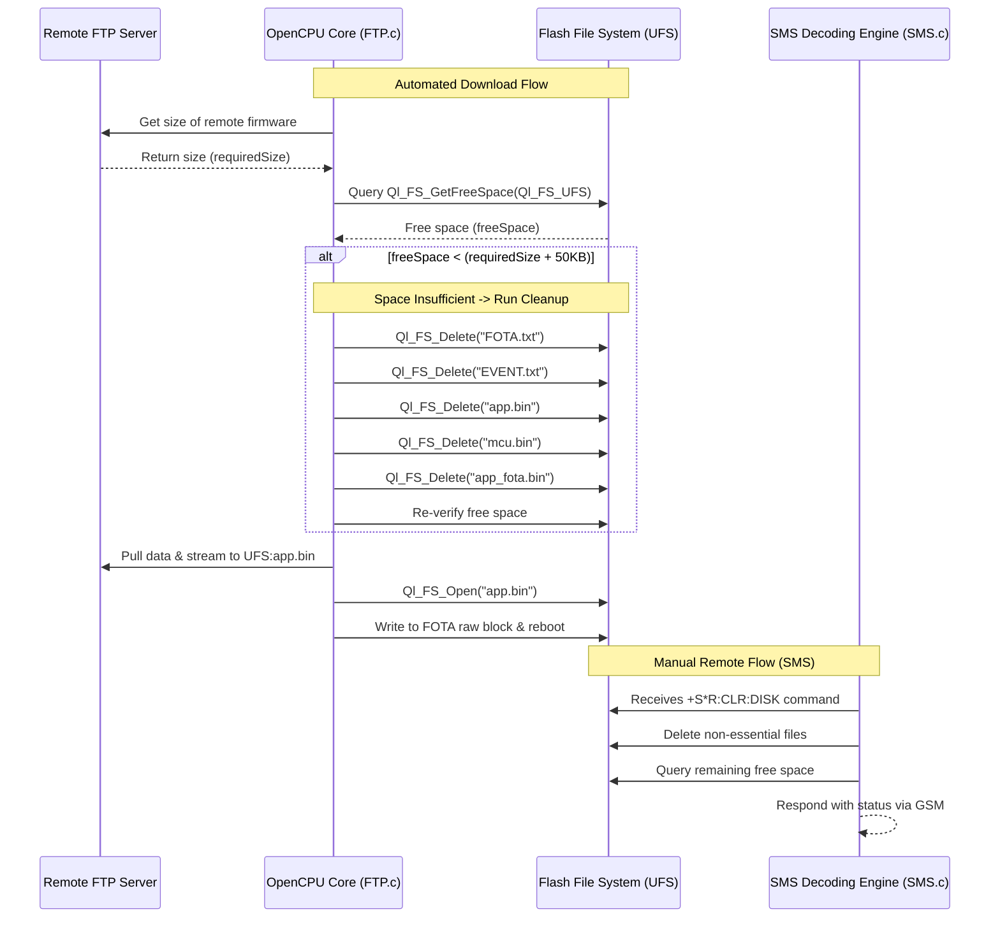
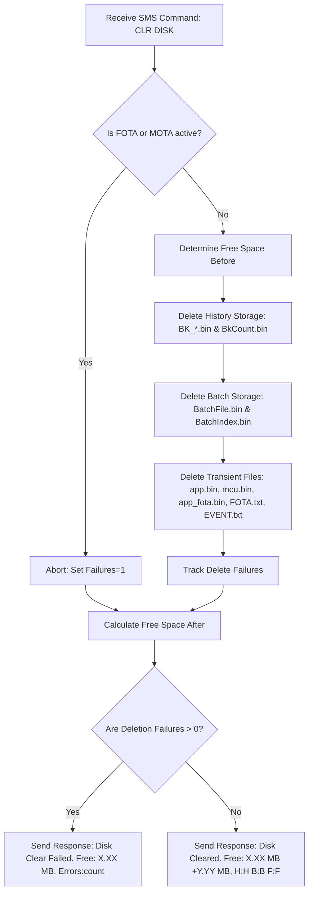

# FTP/FOTA UFS Storage and Disk Space Cleanup System Documentation

This documentation describes the design, architecture, implementation, and operations of the FTP/FOTA firmware download storage and safety cleanup system in the `InnoVTSM66-AI` firmware codebase.

---

## 1. Architectural Overview

To update the firmware of the Quectel M66 OpenCPU module, a binary image is retrieved via FTP and written block-by-block into the raw flash partition using the Quectel FOTA API.

Because the M66 module operates under strict memory and storage constraints, the storage approach uses a **Hybrid UFS Protection System**:
* **UFS Persistent Storage**: Firmwares are downloaded to the flash User File System (`UFS:app.bin` / `UFS:mcu.bin`). This prevents RAM exhaustion issues (the dynamic heap is only ~1.5MB to 2.0MB, which makes downloading full `~1MB+` images to RAM unsafe).
* **Automated Pre-Download UFS Cleanup**: Prior to launching any download, the available space on the flash drive is programmatically queried. If it falls below a threshold, disposable update artifacts are deleted and the oldest history is purged only if needed for the download.
* **On-Demand Remote SMS command**: Provides field engineers with a diagnostic interface to query free disk space (`GET DISK`) and deliberately clear recoverable storage (`CLR DISK`).

### **System Workflow**



---

## 2. Code Mappings & Implementation Details

### **A. Storage Configuration Paths**
* **File Reference**: [custom/inc/FTP.h](file:///d:/QUICKTEL/InnoVTSM66_VY/InnoVTSM66/custom/inc/FTP.h)

The system enforces persistent storage by disabling `FTP_FILE_RAM`. The target files are defined directly as:
```c
#define SERVER_FOTA_FILEPATH        "app.bin"
#define SERVER_MOTA_FILEPATH        "mcu.bin"
```

---

### **B. Pre-Download Disk Cleanup API**
* **File Reference**: [custom/FTP.c](file:///d:/QUICKTEL/InnoVTSM66_VY/InnoVTSM66/custom/FTP.c)

#### **1. Cleanup Implementation (`FTP_CleanupDiskSpace`)**
This public helper handles selective pre-download cleanup:
```c
static void FTP_CleanupDiskSpace(uint32_t requiredSize)
{
    uint32_t freeSpace = Ql_FS_GetFreeSpace(Ql_FS_UFS);
    LOGData(TAG_FTP, "UFS Free Space before cleanup: %lu bytes. Required: %lu bytes", freeSpace, requiredSize);
    
    // Clean when free space is below the required size plus a 50KB safety margin.
    if (requiredSize == 0 || freeSpace < (requiredSize + 51200))
    {
        LOGData(TAG_FTP, "Insufficient UFS space. Initiating selective cleanup...");
        
        // 1. Delete large logs
        Ql_FS_Delete("FOTA.txt");
        Ql_FS_Delete("EVENT.txt");
        
        // 2. Delete old firmware/temp downloads
        Ql_FS_Delete("app.bin");
        Ql_FS_Delete("mcu.bin");
        Ql_FS_Delete("app_fota.bin");
        
        freeSpace = Ql_FS_GetFreeSpace(Ql_FS_UFS);
        
#ifndef HISTORY_DISABLED
        // 3. Purge history packets or CDAC batch storage if space is still insufficient
        if (requiredSize > 0 && freeSpace < (requiredSize + 51200))
        {
            #if defined(PROTO_CDAC)
            LOGData(TAG_FTP, "UFS space still low (%lu bytes), clearing CDAC batch storage...", freeSpace);
            ClearFileTable();
            #else
            uint32_t neededSpace = (requiredSize + 51200) - freeSpace;
            // Each history packet is 512 bytes on disk
            uint16_t packetsToDelete = (neededSpace + 511) / 512;
            LOGData(TAG_FTP, "UFS space still low (%lu bytes), purging oldest %u history packets...", freeSpace, packetsToDelete);
            DeleteFirstPacketsBulk(packetsToDelete);
            #endif
            freeSpace = Ql_FS_GetFreeSpace(Ql_FS_UFS);
        }
#endif
        
        LOGData(TAG_FTP, "UFS Free Space after cleanup: %lu bytes", freeSpace);
    }
}
```

#### **2. Integration Point (`FTPDownloadFileWithStorage`)**
The cleanup routine is run inside `FTPDownloadFileWithStorage()` right after checking file size:
```c
    if(!FTPGetFileSize(remoteName,&FileSize))
    {
        LOGData(TAG_FTP,"Couldn't get Filesize for %s",remoteName);
        return 0;
    }
    LOGData(TAG_FTP,"Got File Size: %d",FileSize);

    FTP_CleanupDiskSpace(FileSize);
```

---

### **C. Standard Flash File Operations**
* **File Reference**: [custom/FTP.c](file:///d:/QUICKTEL/InnoVTSM66_VY/InnoVTSM66/custom/FTP.c)

All RAM-file opening code (specifically `Ql_FS_OpenRAMFile` triggers and `isRAMFile` flag evaluation) has been removed from `FOTAUpdate`. The updater now directly accesses the UFS file system via the standard file descriptor API:
```c
    // Open firmware file
    fileHandle = Ql_FS_Open(firmwareFileName, QL_FS_READ_ONLY);
```

---

### **D. Manual remote SMS Cleanup & Query Hooks**
* **File Reference**: [custom/SMS.c](file:///d:/QUICKTEL/InnoVTSM66_VY/InnoVTSM66/custom/SMS.c)

The standard command parsers inside `DecodeSMS()` handle UFS free-space queries:
```c
		if(Ql_strstr(fn,"DISK"))
		{
			uint32_t freeSpace = Ql_FS_GetFreeSpace(Ql_FS_UFS);
			Ql_sprintf(SimData, "UFS Disk Space: %0.2f MB Free",
				(double)freeSpace / (1024.0 * 1024.0));
			SendResponce(SMSSender, SimData, IsServer, 0);
			return 1;
		}
```
`CLR DISK` uses the dedicated recoverable-data clear routine and reports failures accurately:
```c
		ls = Ql_strstr(fn,"DISK");
		if(ls)
		{
			DiskCleanupResult cleanup = {0};
			if (FTP_ClearRecoverableDiskData(&cleanup))
				Ql_sprintf(SimData, "Disk Cleared. Free: %0.2f MB ...",
					(double)cleanup.freeSpaceAfter / (1024.0 * 1024.0));
			else
				Ql_sprintf(SimData, "Disk Clear Failed. Free: %0.2f MB, Errors:%u",
					(double)cleanup.freeSpaceAfter / (1024.0 * 1024.0), cleanup.failures);
			SendResponce(SMSSender, SimData, IsServer, cleanup.failures == 0);
			return 1;
		}
```

---

## 3. Important Safety Guidelines

> [!CAUTION]
> **Wiping UFS using `Ql_FS_Format` is strictly forbidden**
> 
> Quectel modules store active calibrations, IMEI, IMEI configurations, network provisioning profiles, and non-volatile device parameter files in the root partition. Running `Ql_FS_Format` formats the storage, which deletes these records, bricks the communication channels, and requires physical module reprogramming.
> 
> Always use `Ql_FS_Delete` on explicitly targeted file names as implemented above.

---

## 4. Verification and Commands Reference

### **Clean & Compile Commands**
To rebuild the firmware from scratch, run this in the repository root directory:
```powershell
.\Make.bat new
```
Verify the output finishes with:
```text
- GCC Compiling Finished Sucessfully.
- The target image is in the 'build\gcc' directory.
```

### **SMS Control Diagnostics Commands**
1. **Query Storage Space Command**:
   * **Command Syntax**: `GET DISK`
   * **Successful Execution Return**: `UFS Disk Space: X.XX MB Free`

2. **Clear Recoverable Storage Command**:
   * **Command Syntax**: `CLR DISK`
   * **Implementation**: Calls `FTP_ClearRecoverableDiskData()` rather than the FOTA pre-download helper. It removes `BK_*.bin` history packets, `BkCount.bin`, `BatchFile.bin`, `BatchIndex.bin`, and stale OTA/download artifacts (`app.bin`, `mcu.bin`, `app_fota.bin`).
   * **Preserved**: `UFSConfig.bin`, `State.bin`, and `FotaConfig.bin` remain intact; the command never formats UFS.
   * **Safety**: The command fails while FOTA/MOTA is active and reports deletion failures instead of claiming success.
   * **Successful Execution Return**: `Disk Cleared. Free: X.XX MB (+Y.YY MB), H:<history> B:<batch> F:<files>`
   * **Failure Return**: `Disk Clear Failed. Free: X.XX MB, Errors:<count>`

---

## 5. Remote Storage Recovery Architecture & Safety Mechanisms

The deliberate storage recovery system via SMS commands handles cleaning the module's space while preserving key network and calibration settings. It relies on a multi-stage safety checklist to avoid bricking the terminal:



### Detailed Deletion Tracking & Failure Diagnostics

#### 1. active FOTA/MOTA Interlock
If an Over-The-Air upgrade is actively streaming or writing to flash (`IsFotaProcessing` or `IsMotaProcessing` is set), the command is aborted immediately. This prevents race conditions where the active download binary (`app.bin` or `mcu.bin`) is deleted during a write. The diagnostic response flags this as a single error.

#### 2. History Storage Purging (`ClearHistoryStorage`)
Removes all backup history packets matching `BK_*.bin` (up to `MAX_PACKET_COUNT`). It also removes the `BkCount.bin` indexing metadata. If any of the existing files fails to delete, the failure count is incremented.

#### 3. Batch Storage Purging (`ClearBatchStorage`)
Cleans the batch logging buffers `BatchFile.bin` and `BatchIndex.bin`. Any deletion failures of these queue descriptors are added to the diagnostic error counter.

#### 4. Transient/Log Artifact Deletion
Removes firmware target downloads and logging dumps:
* `app.bin`
* `mcu.bin`
* `app_fota.bin`
* `FOTA.txt`
* `EVENT.txt`

If a file is present on the UFS but the filesystem interface fails to delete it via `Ql_FS_Delete()`, the failure count `result->failures` is incremented.

### Status Reporting

The diagnostic output dynamically calculates the recovered space using a double-precision float:
* **Freed Calculation**: `cleanup.freeSpaceAfter - cleanup.freeSpaceBefore`
* **Success Output**: If `cleanup.failures == 0`, a `1` is sent back in the SMS framework indicating success, and the user receives a message detailing the space saved and count of purged files:
  `Disk Cleared. Free: 0.35 MB (+0.12 MB), H:20 B:1 F:3`
* **Failure Output**: If any file fails to delete, or if the operation is rejected due to active FOTA/MOTA processing, a `0` is passed back to `SendResponce` indicating failure, and the user is notified with:
  `Disk Clear Failed. Free: 0.15 MB, Errors:3`

