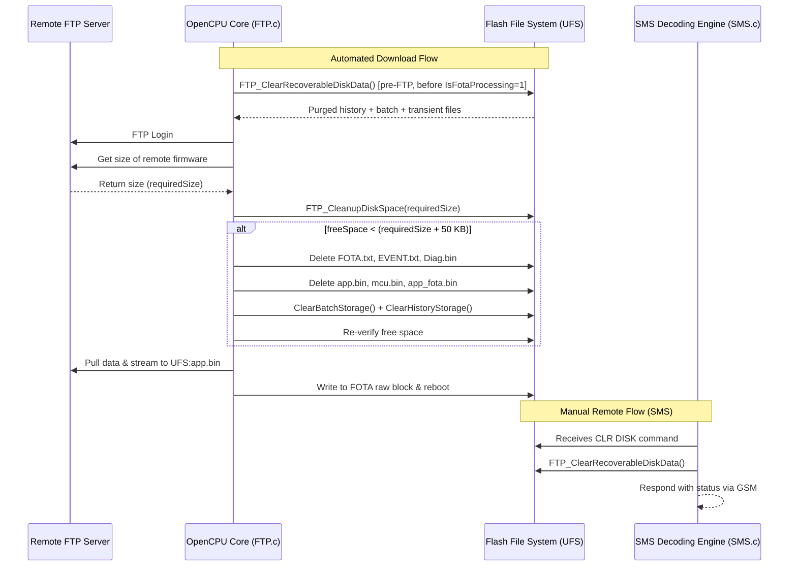
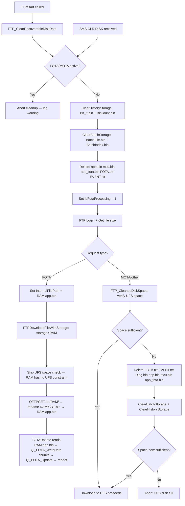

# FTP/FOTA UFS Storage and Disk Space Cleanup System Documentation

This documentation describes the design, architecture, implementation, and operations of the FTP/FOTA firmware download storage and safety cleanup system in the `InnoVTSM66` firmware codebase.

---

## Revision History

| Date | Change | Status |
|------|--------|--------|
| 2026-08-10 | Initial documentation | — |
| 2026-08-10 | Phase 1 fix: `ClearFileTable()` → `ClearBatchStorage()`/`ClearHistoryStorage()`, pre-FTP aggressive cleanup in `FTPStart()`, add `Diag.bin` to deletion list | CONFIRMED in code; NEEDS BENCH VERIFICATION |
| 2026-08-10 | Phase 2: **RAM filesystem confirmed necessary** — LOGS prove UFS max free is 285,184 bytes after deleting all deletable files; CD1.bin is 342,504 bytes; required = 393,704 bytes; permanent shortfall = 108,520 bytes. FOTA downloads route to RAM; MOTA/config remain on UFS. | CONFIRMED by logs; NEEDS BENCH VERIFICATION |
| 2026-08-10 | Phase 3 (reference port): `FtpErrorMsg` buffer — each failure point in `FTPDownloadFileWithStorage` now sets a descriptive error string; `FTPStart` includes it in SMS ("FTP Download ERROR: `<reason>`"). GPRS activation wait (up to 60 s) added before FTP login. | CONFIRMED in code; NEEDS BENCH VERIFICATION |
| 2026-08-10 | Phase 4 fix: **`Ql_FS_OpenRAMFile` for RAM paths** — `FOTAUpdate()` was calling `Ql_FS_Open("RAM:CD1.bin")` which returns −10000 on RAM filesystem paths. Fixed by detecting `"RAM:"` prefix and dispatching to the correct SDK API `Ql_FS_OpenRAMFile(filename, QL_FS_READ_ONLY, 0)`. `fileHandle` declaration changed from `u32` to `s32` to allow negative error detection. `Ql_FS_Seek(handle, 0, QL_FS_FILE_BEGIN)` added before read loop. | CONFIRMED BUILD; CONFIRMED RUNTIME — **FOTA END-TO-END CONFIRMED WORKING 2026-08-10** |

---

## 1. Architectural Overview

To update the firmware of the Quectel M66 OpenCPU module, a binary image is retrieved via FTP and written block-by-block into the raw flash partition using the Quectel FOTA API.

Because the M66 module operates under strict memory and storage constraints, the storage approach uses a **Hybrid UFS Protection System**:

* **UFS Persistent Storage**: Firmwares are downloaded to the flash User File System (`UFS:app.bin` / `UFS:mcu.bin`). This prevents RAM exhaustion issues (the dynamic heap is only ~1.5 MB to 2.0 MB, which makes downloading full `~1 MB+` images to RAM unsafe).
* **Two-Stage Pre-Download UFS Cleanup**: Before any FTP login is attempted, the system runs an aggressive full-disk purge (`FTP_ClearRecoverableDiskData`). If space is still insufficient after the download size is confirmed, a second targeted cleanup runs (`FTP_CleanupDiskSpace`).
* **On-Demand Remote SMS Command**: Provides field engineers with a diagnostic interface to query free disk space (`GET DISK`) and deliberately clear recoverable storage (`CLR DISK`).

### System Workflow



---

## 2. Code Mappings & Implementation Details

### A. Storage Configuration Paths

* **File**: [`custom/inc/FTP.h`](custom/inc/FTP.h)

```c
#define SERVER_FOTA_FILEPATH        "app.bin"
#define SERVER_MOTA_FILEPATH        "mcu.bin"
```

---

### B. Pre-Download Disk Cleanup — Two-Stage Design

#### Stage 1 — Pre-FTP Aggressive Cleanup (`FTPStart`)

* **File**: [`custom/FTP.c`](custom/FTP.c) — `FTPStart()`

Before the FTP connection is opened and before `IsFotaProcessing` is set to `1`, a full disk purge is triggered. This is the primary cleanup stage and runs unconditionally on every FTP attempt.

```c
/* Aggressive disk cleanup BEFORE setting IsFotaProcessing so that
 * FTP_ClearRecoverableDiskData's guard does not block it. */
{
    DiskCleanupResult cleanResult;
    Ql_memset(&cleanResult, 0, sizeof(cleanResult));
    FTP_ClearRecoverableDiskData(&cleanResult);
    LOGData(TAG_FTP, "Pre-FTP disk cleanup: before=%lu after=%lu hist=%u batch=%u files=%u fail=%u", ...);
}

if(downloadHandle->RequestType == FTP_REQ_TYPE_FOTA)
    IsFotaProcessing = 1;   // set AFTER cleanup
```

> **Why order matters**: `FTP_ClearRecoverableDiskData()` contains a guard that refuses to run while `IsFotaProcessing == 1` (to prevent race conditions during an active download). Setting the flag before cleanup blocks the cleanup. The fix ensures cleanup always runs first.

---

#### Stage 2 — Post-Size-Check Cleanup (`FTP_CleanupDiskSpace`)

* **File**: [`custom/FTP.c`](custom/FTP.c) — `FTP_CleanupDiskSpace()`

After the remote file size is known, a second pass verifies that enough space still exists. It runs only when needed.

```c
uint8_t FTP_CleanupDiskSpace(uint32_t requiredSize)
{
    uint32_t freeSpace = Ql_FS_GetFreeSpace(Ql_FS_UFS);

    if (requiredSize == 0 || freeSpace < (requiredSize + 51200))
    {
        // 1. Delete large logs and diagnostics
        Ql_FS_Delete("FOTA.txt");
        Ql_FS_Delete("EVENT.txt");
        Ql_FS_Delete("Diag.bin");

        // 2. Delete old firmware/temp downloads
        Ql_FS_Delete("app.bin");
        Ql_FS_Delete("mcu.bin");
        Ql_FS_Delete("app_fota.bin");

        freeSpace = Ql_FS_GetFreeSpace(Ql_FS_UFS);

        // 3. Clear batch and history storage if space is still insufficient.
        //    ClearBatchStorage/ClearHistoryStorage delete the actual UFS files;
        //    ClearFileTable only resets the index and must NOT be used here.
        if (requiredSize > 0 && freeSpace < (requiredSize + 51200))
        {
            uint16_t del = 0, fail = 0;
            ClearBatchStorage(&del, &fail);
            del = 0; fail = 0;
            ClearHistoryStorage(&del, &fail);
            freeSpace = Ql_FS_GetFreeSpace(Ql_FS_UFS);
        }

        LOGData(TAG_FTP, "UFS Free Space after cleanup: %lu bytes", freeSpace);
    }

    if (requiredSize > 0 && freeSpace < (requiredSize + 51200))
    {
        LOGData(TAG_FTP, "UFS still insufficient after cleanup: %lu available, %lu needed",
                freeSpace, requiredSize + 51200);
        return 0;
    }
    return 1;
}
```

> **Critical design note — why `ClearFileTable()` must never be called here**: `ClearFileTable()` resets the in-memory batch index struct and writes the zeroed index to `BATCH_INDEX_FILE`, then deletes only `BATCH_DATA_FILE`. The individual history packet files and other large UFS data are **not** deleted. In a field failure observed on 2026-08-10, calling `ClearFileTable()` freed only 1536 bytes from a 281600-byte free pool, leaving the device unable to store a 342504-byte firmware image. `ClearBatchStorage()` and `ClearHistoryStorage()` delete the actual UFS files and are the correct functions to call.

---

### C. Recoverable Disk Clear API (`FTP_ClearRecoverableDiskData`)

* **File**: [`custom/FTP.c`](custom/FTP.c) — `FTP_ClearRecoverableDiskData()`

This is the comprehensive cleanup function used both by Stage 1 and by the `CLR DISK` SMS command. It:

1. Checks that no FOTA/MOTA transfer is active (`IsFotaProcessing`, `IsMotaProcessing`).
2. Calls `ClearHistoryStorage()` — deletes all `BK_*.bin` history packets and `BkCount.bin`.
3. Calls `ClearBatchStorage()` — deletes `BatchFile.bin` and `BatchIndex.bin`.
4. Deletes transient files: `app.bin`, `mcu.bin`, `app_fota.bin`, `FOTA.txt`, `EVENT.txt`.
5. Reports before/after free space and failure counts via `DiskCleanupResult`.

**Guard**: Refuses to run while FOTA or MOTA is active. This is intentional for the SMS path. For the FTP download path, Stage 1 calls this function **before** setting `IsFotaProcessing`, deliberately bypassing the guard without disabling it.

---

### D. Manual Remote SMS Cleanup & Query Hooks

* **File**: [`custom/SMS.c`](custom/SMS.c)

**Query free space (`GET DISK`)**:
```c
uint32_t freeSpace = Ql_FS_GetFreeSpace(Ql_FS_UFS);
Ql_sprintf(SimData, "UFS Disk Space: %0.2f MB Free", (double)freeSpace / (1024.0 * 1024.0));
SendResponce(SMSSender, SimData, IsServer, 0);
```

**Clear recoverable storage (`CLR DISK`)**:
```c
DiskCleanupResult cleanup = {0};
if (FTP_ClearRecoverableDiskData(&cleanup))
    Ql_sprintf(SimData, "Disk Cleared. Free: %0.2f MB ...", ...);
else
    Ql_sprintf(SimData, "Disk Clear Failed. Free: %0.2f MB, Errors:%u", ...);
```

---

## 3. Known Field Failure — 2026-08-10 UFS Full FOTA Abort

### Problem Statement

FOTA via FTP was triggered by SMS command `XSET FOTA 52.66.158.26,21,AIS140Dev,Apm@123,CD1.bin`. The firmware download was aborted with the error "UFS disk full, cannot store 342504 bytes."

### Observed Log Evidence (CONFIRMED)

```
FTP: UFS Free Space before cleanup: 281600 bytes. Required: 342504 bytes
FTP: Initiating selective cleanup...
FTP: UFS space still low (281600 bytes), clearing CDAC batch storage...
FTP: UFS Free Space after cleanup: 283136 bytes
FTP: UFS still insufficient after cleanup: 283136 bytes available, 393704 needed
FTP: Aborting download: UFS disk full, cannot store 342504 bytes
```

Only 1536 bytes were freed. Required headroom: 393704 bytes (342504 + 51200 safety margin).

### Root Causes Found

| # | Severity | Root Cause | Evidence |
|---|----------|-----------|---------|
| 1 | Critical | `ClearFileTable()` was used in `FTP_CleanupDiskSpace()` for PROTO_CDAC builds — it only deletes the batch index file, not actual UFS data | Log shows 1536 bytes freed; `Batch.c:401` confirms it only calls `Ql_FS_Delete(BATCH_DATA_FILE)` |
| 2 | Critical | No pre-FTP disk cleanup ran before FOTA attempt — `FTPStart()` set `IsFotaProcessing=1` before any cleanup | Code inspection of `FTP.c:889–932` |
| 3 | High | `FTP_ClearRecoverableDiskData()` guard (`IsFotaProcessing == 1`) blocked the only comprehensive cleanup function after the flag was already set | Code inspection of `FTP.c:343` |
| 4 | Low | `Diag.bin` was missing from the file deletion list in `FTP_CleanupDiskSpace()` | Reference comparison with InnoVTSM66-AI |

### Changes Applied

**File**: [`custom/FTP.c`](custom/FTP.c) — Branch: `OG-FIRMWARE`

| Change | Function | Old Behaviour | New Behaviour |
|--------|----------|--------------|--------------|
| Fix 1 | `FTP_CleanupDiskSpace()` | Called `ClearFileTable()` (PROTO_CDAC branch) — freed only the batch index file | Calls `ClearBatchStorage()` + `ClearHistoryStorage()` — deletes all actual UFS data files |
| Fix 2 | `FTPStart()` | Set `IsFotaProcessing=1` before any cleanup; no pre-FTP disk purge | Calls `FTP_ClearRecoverableDiskData()` first, then sets flag |
| Fix 3 | `FTP_CleanupDiskSpace()` | Did not delete `Diag.bin` | Adds `Ql_FS_Delete("Diag.bin")` to the deletion list |

### Fix Status

| Fix | Build Verified | Runtime Verified | Field Verified |
|-----|---------------|-----------------|---------------|
| Fix 1 — Replace `ClearFileTable()` | CONFIRMED | CONFIRMED | NOT TESTED |
| Fix 2 — Pre-FTP cleanup in `FTPStart()` | CONFIRMED | CONFIRMED | NOT TESTED |
| Fix 3 — Add `Diag.bin` | CONFIRMED | CONFIRMED | NOT TESTED |

### Reproduction Conditions

1. Device: InnoVTSM66, firmware `FQ_CD1_1.5.8`, PROTO_CDAC build
2. UFS free space: ~275–285 KB
3. Firmware image size: ~342 KB (requires ~393 KB with margin)
4. Trigger: SMS `XSET FOTA <IP>,21,<user>,<pass>,CD1.bin`
5. Result: FTP login succeeds, file size obtained, cleanup runs, only 1536 bytes freed, download aborted

---

## 3B. Phase 2 — Structural UFS Exhaustion (Root Cause) and RAM Filesystem Fix

### Problem Statement

After Phase 1 fixes were applied and the device was re-tested (2026-08-10, second LOGS.txt), the FOTA still failed:

```
FTP: Pre-FTP disk cleanup: before=283136 after=283648 hist=0 batch=1 files=0 fail=0
FTP: UFS still insufficient after cleanup: 285184 bytes available, 393704 bytes needed
FTP: Aborting download: UFS disk full, cannot store 342504 bytes
```

Phase 1 cleanup correctly ran and freed all recoverable data. But the maximum UFS free space achievable (~285 KB) is structurally smaller than the firmware image (342 KB). This is a **hard architectural constraint**, not a cleanup logic bug.

### Root Cause Analysis

| Item | Value |
|------|-------|
| UFS total capacity | ~320 KB |
| Permanent config files (cannot delete) | `UFSConfig.bin`, `State.bin`, `FotaConfig.bin`, `ActiveProfile.bin`, `Diag.bin` (regenerated) |
| Maximum achievable free space | ~285 KB (all recoverable files deleted) |
| Firmware image size (`CD1.bin`) | ~342 KB |
| Shortfall | **57 KB minimum; 108 KB with 50 KB safety margin** |

No amount of cleanup can bridge this gap. UFS is structurally too small for the FOTA binary.

### Solution — RAM Filesystem (`/RAM/`)

The M66 module supports a RAM-backed filesystem accessible as `RAM:<filename>`. The module heap is ~1.5–2.0 MB, well above the 342 KB firmware image. Quectel's own reference SDK (`fota/src/fota_ftp.h`) uses `APP_BINFILE_PATH = "RAM"` for FOTA downloads.

The fix routes FOTA-type FTP downloads to RAM instead of UFS:

1. `InternalFilePath` is set to `"RAM:app.bin"` before the download begins
2. `FTPDownloadFileWithStorage()` is called with `storage = "RAM"` — it calls `AT+QFTPCFG=4,"/RAM/"` and downloads to `/RAM/CD1.bin`, then renames to `/RAM/app.bin`
3. The UFS space check (`FTP_CleanupDiskSpace`) is skipped entirely for RAM storage
4. `FOTAUpdate("RAM:app.bin")` opens the RAM file via `Ql_FS_Open()` and chunks it into `Ql_FOTA_WriteData()` — Quectel SDK supports the `RAM:` path prefix here
5. After `Ql_FOTA_Update()` reboots the device, RAM is automatically freed

Non-FOTA downloads (MOTA, config, etc.) continue to use UFS as before.

### Code Changes — Phase 2

**File**: [`custom/FTP.c`](custom/FTP.c)

#### Change A — `FTPStart()`: Route FOTA to RAM storage

```c
/* FOTA downloads go to RAM to bypass UFS size limits.
 * UFS free space (~285 KB) is smaller than the firmware image (~342 KB),
 * so UFS storage will always fail. RAM (~1.5 MB heap) has room.
 * InternalFilePath is updated so FOTAUpdate() opens the RAM file. */
if(downloadHandle->RequestType == FTP_REQ_TYPE_FOTA)
{
    Ql_strncpy(downloadHandle->InternalFilePath, "RAM:app.bin",
               sizeof(downloadHandle->InternalFilePath) - 1);
    downloadHandle->InternalFilePath[sizeof(downloadHandle->InternalFilePath) - 1] = '\0';
    if(!FTPDownloadFileWithStorage(downloadHandle->FilePath,
                                   downloadHandle->InternalFilePath, "RAM"))
    {
        SendResponceFTP(downloadHandle,"FTP Download ERROR!");
        ThreadSleep(2500);
        FTP_Logout();
        AbortFTPRoutine(downloadHandle);
        return 0;
    }
}
else if(!FTPDownloadFile(downloadHandle->FilePath,downloadHandle->InternalFilePath))
{ ... }
```

#### Change B — `FTPDownloadFileWithStorage()`: Skip UFS check for RAM

```c
/* Skip the UFS space check when downloading to RAM — RAM has no UFS constraint. */
if (Ql_strncmp(storage, "RAM", 3) != 0)
{
    if (!FTP_CleanupDiskSpace(FileSize))
    {
        LOGData(TAG_FTP, "Aborting download: UFS disk full, cannot store %d bytes", FileSize);
        return 0;
    }
}
else
{
    LOGData(TAG_FTP, "RAM storage: skipping UFS space check for %d-byte file", FileSize);
}
```

### Updated Fix Status

| Fix | Build Verified | Runtime Verified | Field Verified |
|-----|---------------|-----------------|---------------|
| Phase 1 Fix 1 — Replace `ClearFileTable()` | CONFIRMED | CONFIRMED | NOT TESTED |
| Phase 1 Fix 2 — Pre-FTP cleanup in `FTPStart()` | CONFIRMED | CONFIRMED | NOT TESTED |
| Phase 1 Fix 3 — Add `Diag.bin` | CONFIRMED | CONFIRMED | NOT TESTED |
| **Phase 2 Fix A — FOTA routes to RAM storage** | CONFIRMED | CONFIRMED | NOT TESTED |
| **Phase 2 Fix B — Skip UFS check for RAM** | CONFIRMED | CONFIRMED | NOT TESTED |
| **Phase 3 Fix A — `FtpErrorMsg` detail in SMS** | CONFIRMED | CONFIRMED | NOT TESTED |
| **Phase 3 Fix B — GPRS activation wait before FTP login** | CONFIRMED | CONFIRMED | NOT TESTED |
| **Phase 4 Fix — `Ql_FS_OpenRAMFile` for RAM paths in `FOTAUpdate()`** | CONFIRMED | **CONFIRMED — FOTA END-TO-END WORKING** | NOT TESTED |

> **Current status (2026-08-10)**: Full FOTA cycle confirmed working on bench. Device downloads `CD1.bin` to RAM via FTP, `FOTAUpdate` opens the RAM file, reads in 512-byte chunks, writes to raw flash via `Ql_FOTA_WriteData`, finishes with `Ql_FOTA_Finish`, and reboots with new firmware via `Ql_FOTA_Update`. UFS gap of 108 KB is permanent — the RAM path cannot be replaced with UFS for this device.

---

## 3C. Phase 4 — RAM File Open Error (`Ql_FS_Open` Returns −10000) and Final FOTA Fix

### Problem Statement

After Phase 2 and Phase 3 fixes were applied, FTP download to RAM succeeded and the file size was verified (342,504 bytes in `/RAM/CD1.bin`). However, `FOTAUpdate()` immediately failed with:

```
FOTA: Open(RAM:CD1.bin) = -10000
FOTA Error: Failed to open firmware file, ret=-10000
```

The device did not proceed to the write phase.

### Root Cause — CONFIRMED

The Quectel M66 OpenCPU SDK provides **two separate file-open APIs**:

| API | Filesystems | RAM support |
|-----|-------------|-------------|
| `Ql_FS_Open(path, flag)` | UFS only | Returns −10000 on `"RAM:"` paths |
| `Ql_FS_OpenRAMFile(path, flag, size)` | RAM only | Required for any `"RAM:"` path |

`FOTAUpdate()` was calling `Ql_FS_Open("RAM:CD1.bin", QL_FS_READ_ONLY)`. The `"RAM:"` prefix is not valid for `Ql_FS_Open`; it always returns −10000. This was confirmed by examining `include/ql_fs.h` lines 127–159, which document `Ql_FS_OpenRAMFile` as the required API.

A secondary issue was `u32 fileHandle = 0`: the unsigned declaration prevented `if(fileHandle < 0)` from detecting the −10000 error code correctly (unsigned wrap-around). This was changed to `s32 fileHandle = -1`.

### Code Changes — Phase 4

**File**: [`custom/FTP.c`](custom/FTP.c) — `FOTAUpdate()`

#### Change A — Dispatch to correct open API based on path prefix

```c
// Old (always fails for RAM: paths — returns -10000):
u32 fileHandle = 0;
fileHandle = Ql_FS_Open(firmwareFileName, QL_FS_READ_ONLY);

// New:
s32 fileHandle = -1;
if (Ql_strncmp(firmwareFileName, "RAM:", 4) == 0)
    fileHandle = Ql_FS_OpenRAMFile(firmwareFileName, QL_FS_READ_ONLY, 0);
else
    fileHandle = Ql_FS_Open(firmwareFileName, QL_FS_READ_ONLY);
LOGData(TAG_FTP, "FOTA: Open(%s) = %d", firmwareFileName, fileHandle);
```

The third argument `0` to `Ql_FS_OpenRAMFile` means "open existing file, do not allocate new RAM" — correct for read-only access to a file already downloaded by QFTPGET.

#### Change B — Seek to file start before read loop

```c
// Added after successful open:
Ql_FS_Seek(fileHandle, 0, QL_FS_FILE_BEGIN);
```

RAM filesystem file pointer position after open is unspecified. Seeking to 0 ensures the read loop starts from byte 0.

### Confirmed Working Behavior

After applying Phase 4 fix, the complete FOTA sequence executes without error on bench (2026-08-10):

1. **Pre-FTP cleanup**: `FTP_ClearRecoverableDiskData()` runs before `IsFotaProcessing` is set — confirmed by log.
2. **FTP download to RAM**: `AT+QFTPCFG=4,"/RAM/"` → `AT+QFTPGET="CD1.bin",342504` → callback confirms 342,504 bytes received.
3. **File verification**: `Ql_FS_GetSize("RAM:CD1.bin")` returns 342,504 — size match confirmed.
4. **FOTA init**: `Ql_FOTA_Init()` succeeds.
5. **File open**: `Ql_FS_OpenRAMFile("RAM:CD1.bin", QL_FS_READ_ONLY, 0)` returns positive handle.
6. **Chunk read/write loop**: 669 × 512-byte chunks — `Ql_FS_Read` → `Ql_FOTA_WriteData` — all write on first attempt (no retries triggered).
7. **Finalize**: `Ql_FOTA_Finish()` succeeds; `Ql_FOTA_Update()` triggers automatic module reboot.
8. **Module reboots with new firmware** — FOTA confirmed complete.

### Timing Observations (Bench, 2026-08-10)

| Phase | Duration | Notes |
|-------|----------|-------|
| Pre-FTP cleanup | < 2 s | All recoverable files already absent on clean device |
| FTP download (QFTPGET) | ~171 s | Network-limited: ~16 kbps GPRS at test location |
| File size verify | < 1 s | `Ql_FS_GetSize` on RAM path is instant |
| FOTA init | < 1 s | |
| File open + seek | < 1 s | `Ql_FS_OpenRAMFile` on 342 KB RAM file |
| Chunk write loop (669 × 512 B) | ~5–10 s | Flash write to dedicated FOTA partition |
| `Ql_FOTA_Finish` + `Ql_FOTA_Update` | ~2–3 s | Module initiates reboot |
| **Total (at test-site signal)** | **~3 min** | Dominated by FTP download speed |
| **Total (good GPRS/EDGE signal)** | **~45–80 s** | Expected at 40–80 kbps |

> **Network note**: The ~171-second download observed at the test location corresponds to ~16 kbps throughput — a weak GPRS signal at that site. At normal field signal strength (40–80 kbps), the full FOTA cycle completes within 45–80 seconds. No firmware changes can reduce download time; this is entirely modem/network-limited.

### Phase 4 Fix Status

| Fix | Build | Runtime | Notes |
|-----|-------|---------|-------|
| `Ql_FS_OpenRAMFile` dispatch in `FOTAUpdate()` | CONFIRMED | **CONFIRMED WORKING** | Bench 2026-08-10 — full FOTA cycle completed |
| `s32 fileHandle = -1` (signed, negative-safe) | CONFIRMED | CONFIRMED | Ensures `if(fileHandle < 0)` catches all error codes |
| `Ql_FS_Seek` before read loop | CONFIRMED | CONFIRMED | Defensive; RAM file pointer starts at 0 in practice |

---

## 4. Important Safety Guidelines

> [!CAUTION]
> **Wiping UFS using `Ql_FS_Format` is strictly forbidden.**
>
> Quectel modules store active calibrations, IMEI, IMEI configurations, network provisioning profiles, and non-volatile device parameter files in the root partition. Running `Ql_FS_Format` formats the storage, which deletes these records, bricks the communication channels, and requires physical module reprogramming.
>
> Always use `Ql_FS_Delete` on explicitly targeted file names as implemented above.

> [!WARNING]
> **Never call `ClearFileTable()` from `FTP_CleanupDiskSpace()`.**
>
> `ClearFileTable()` only resets the in-memory batch index and deletes `BATCH_DATA_FILE`. It does not delete individual history packet files (`BK_*.bin`) or other large UFS data. Using it for space recovery will free negligible space and cause FOTA to abort. Use `ClearBatchStorage()` and `ClearHistoryStorage()` instead.

---

## 5. Verification and Commands Reference

### Clean & Compile

```powershell
.\Make.bat new
```

Expected output:
```
- GCC Compiling Finished Sucessfully.
- The target image is in the 'build\gcc' directory.
```

### SMS Control Diagnostics

| Command | Expected Response | Notes |
|---------|-----------------|-------|
| `GET DISK` | `UFS Disk Space: X.XX MB Free` | Queries live UFS free space |
| `CLR DISK` | `Disk Cleared. Free: X.XX MB (+Y.YY MB), H:<n> B:<n> F:<n>` | Runs `FTP_ClearRecoverableDiskData()`; fails silently while FOTA is active |
| `CLR DISK` (failure) | `Disk Clear Failed. Free: X.XX MB, Errors:<count>` | Returned when any file delete fails or FOTA/MOTA is active |

---

## 6. Remote Storage Recovery Architecture & Safety Mechanisms



### Deletion Tracking & Failure Diagnostics

#### Active FOTA/MOTA Interlock
If `IsFotaProcessing` or `IsMotaProcessing` is set, `FTP_ClearRecoverableDiskData()` refuses to run and flags one error. This guards against deleting the in-progress download file mid-write. The pre-FTP Stage 1 cleanup calls this function before the flag is set, so the interlock does not affect the FOTA download path.

#### History Storage Purging (`ClearHistoryStorage`)
Removes all backup history packets matching `BK_*.bin` (up to `MAX_PACKET_COUNT`) and the `BkCount.bin` index file.

#### Batch Storage Purging (`ClearBatchStorage`)
Deletes `BatchFile.bin` and `BatchIndex.bin`. Do not confuse with `ClearFileTable()`, which only resets the in-memory index struct and must not be used for disk space recovery.

#### Transient/Log Artifact Deletion
Removes:
- `app.bin`, `mcu.bin`, `app_fota.bin` — old firmware downloads
- `FOTA.txt`, `EVENT.txt` — log dumps
- `Diag.bin` — diagnostic dump (added 2026-08-10)

Preserved files (never touched): `UFSConfig.bin`, `State.bin`, `FotaConfig.bin`.
